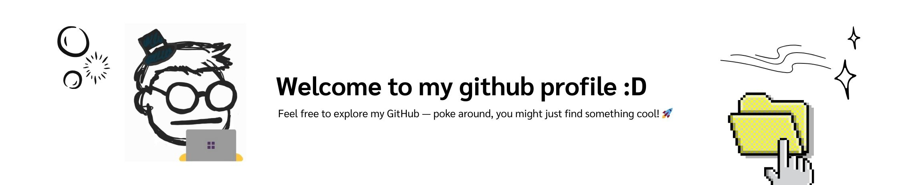

# 👨‍💻 Aphichat Plianrup (Oat)

**`Full-Stack Developer`**

- I'm based in Thailand 
- Currently, I am a fourth-year student majoring in Information Technology. 

  
  
  
  

---

### Tech Stack:

  
  
  
  
  
  
  
  
  
  
  
  
  
  

### Stats:

  
  &nbsp;&nbsp;&nbsp;&nbsp;
  

